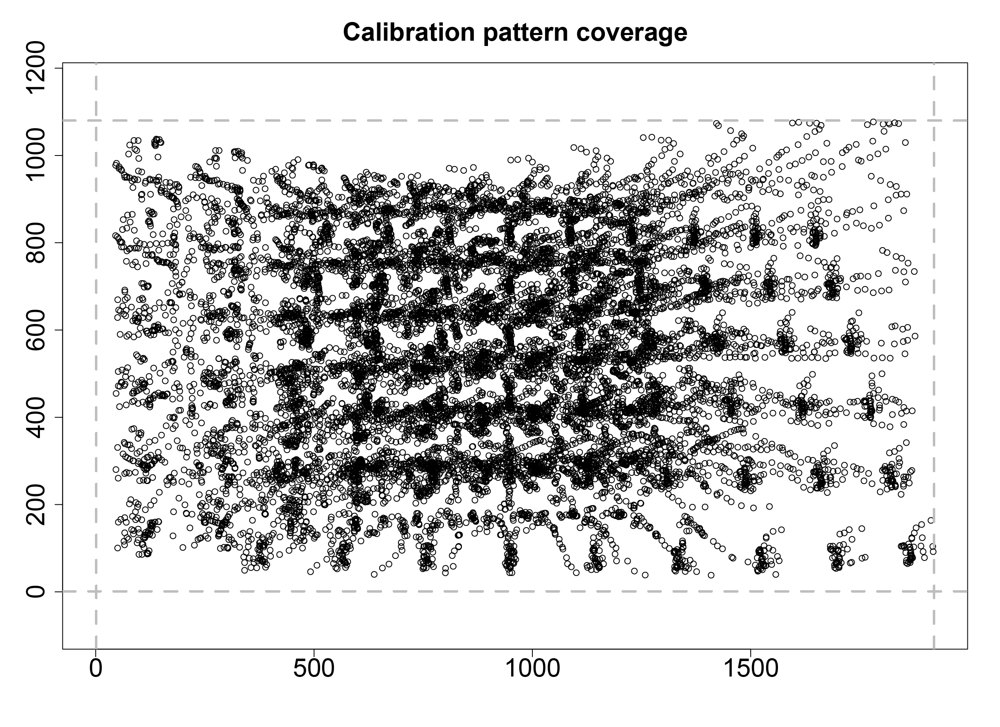

## 8.1 - Camera calibration

Starting with `Rvision` 0.7.1, users can perform basic camera calibration steps 
to correct lens distortion. This can be particularly useful when working with 
cameras that have a wide field of view (e.g., GoPro cameras) and when performing
photogrammetry. 

In this vignette, we will briefly describe the calibration process and provide 
an example of how to calibrate a camera using `Rvision`. 

---

## 8.2 - Calibration process

### 8.2.1 - Calibration pattern

The calibration process is relatively straightforward. First, the user must 
capture a series of images of a calibration target. The calibration target
should be a planar surface with a regular pattern of points (at the time of 
writing, `Rvision` only supports a checkerboard pattern). You can find a sample 
calibration target provided with the `Rvision` package at the following location 
in your hard drive: 

```{r eval=FALSE, echo=TRUE}
system.file("sample_img/checkerboard6x9.png", package = "Rvision")
```

You can print this image and use it as a calibration target, or you can create
your own as long as it represents a checkerboard pattern. 

Once the target is ready, you should take a series of images of it using the
camera that you want to calibrate. The target should be placed at different 
distances from the camera and at different angles. The target should also be 
rotated about the camera's optical axis. An example video of a calibration 
target being used to calibrate a webcam is provided with the `Rvision` package 
at the following location in your hard drive: 

```{r eval=FALSE, echo=TRUE}
system.file("sample_vid/calibration.mp4", package = "Rvision")
```

We will use this video to demonstrate the calibration process.

### 8.2.2 - Calibration steps

#### 8.2.2.1 - Setting the calibration pattern parameters

The first step in the calibration process is to set the calibration pattern
parameters. These parameters are used to detect the calibration pattern in the
images and provide a correspondence between the calibration pattern points and
their image coordinates.

```{r eval=FALSE, echo=TRUE}
# Checkerboard inner dimensions, i.e., the number of inner corners formed by the
# checkerboard pattern. In this case, the checkerboard has 7x10 squares and, 
# therefore, 6x9 inner corners.
cdims <- c(6, 9)

# Size of a checkerboard square in mm. 
ssize <- 22.71

# Checkerboard real-world relative coordinates. The first point is the origin 
# and the remaining points are the coordinates of the remaining inner corners.
# Since the checkerboard is planar, the z-coordinate is always 0.
checkerboard <- as.matrix(
  expand.grid(
    x = 0:(cdims[1] - 1),
    y = 0:(cdims[2] - 1),
    z = 0
  )
) * ssize
```

#### 8.2.2.2 - Detecting the calibration pattern 

The next step is to detect the calibration pattern in the video frame. The 
script below illustrates how to do this with the example video provided with
the `Rvision` package. The different steps are described in the comments. This 
process might not work for your video depending on lighting and image quality,
so you might have to tweak the parameters. This process can also take a long 
time and you might want to skip some frames to speed it up. A good rule of thumb
is to select frames that (1) show the calibration pattern clearly and (2) show 
it at different angles and distances from the camera.

```{r eval=FALSE, echo=TRUE}
# Lists to store reference and image coordinates.
ref_points <- list()
img_points <- list()

# Location of the calibration video.
vid_file <- system.file("sample_vid/calibration.mp4", package = "Rvision")

# Load video and create temporary storage frames.
vid <- video(vid_file)
fr <- zeros(nrow(vid), ncol(vid), 3)
gray <- zeros(nrow(vid), ncol(vid), 1)
bw3 <- zeros(nrow(vid), ncol(vid), 3)

# Skip the first 25 frames that do not show the calibration pattern.
frame(vid) <- 26

# Loop through the video frames.
for (i in 26:nframes(vid)) {
  # Read the next frame.
  readNext(vid, fr)

  # Threshold the frame. This is done by converting each pixel above the average
  # pixel intensity to white and the remaining pixels to black. This is done to
  # remove noise and to make the calibration pattern stand out. This is a very
  # simple thresholding method and might not work for your video.
  compare(fr, mean(mean(fr)), ">", bw3)

  # Find the calibration pattern corners. This is done using the function
  # called `findChessboardCorners`. The first argument is the image to be
  # analyzed. The second and third arguments are the inner dimensions of the
  # checkerboard pattern. The fourth argument is a logical value indicating
  # whether adaptive thresholding should be used. This can be useful to improve
  # the detection of the calibration pattern in images with uneven lighting. 
  # However, it can significantly increase the processing time. We will not use
  # it in this example. The function returns a matrix with the coordinates of
  # the corners. If the function is able to find all the corners, the number of
  # rows in the matrix will be equal to the product of the inner dimensions.
  corners <- findChessboardCorners(bw3, cdims[1], cdims[2], FALSE)

  # If the function was able to find all the corners...
  if (nrow(corners) == prod(cdims)) {
    # Convert the frame to grayscale.
    changeColorSpace(fr, "GRAY", gray)

    # Refine the corner coordinates. This is done using the function called
    # `cornerSubPix`. The first argument is the grayscale image. The second
    # argument is the matrix with the corner coordinates. The function returns a
    # matrix with the refined corner coordinates.
    corners <- cornerSubPix(gray, corners)

    # Store the reference and image coordinates. 
    ref_points[[length(ref_points) + 1]] <- checkerboard
    img_points[[length(img_points) + 1]] <- corners
  }
}
```

You can visualize the coverage of the calibration pattern in the video frames 
as follows:

```{r eval=FALSE, echo=TRUE}
plot(do.call(rbind, img_points),
  xlim = c(1, ncol(vid)), ylim = c(1, nrow(vid)), asp = 1,
  xlab = NA, ylab = NA, main = "Calibration pattern coverage",
  cex.main = 2, cex.axis = 2
)
abline(
  v = c(1, ncol(vid)), h = c(1, nrow(vid)),
  col = "gray", lty = 2, lwd = 3
)
```

```{r out.width = "100%", echo=FALSE}
 
```

In this particular example, the coverage is not perfect, but it is good enough 
for our demonstration purposes.

#### 8.2.2.3 - Compute the camera parameters

The next step is to compute the camera parameters. This is done using the
function called `calibrateCamera`. The first argument is the list of reference
coordinates. The second argument is the list of image coordinates. The third and
fourth arguments are the dimensions the video frames. The last argument is the
maximum number of iterations to be used by the optimization algorithm. The 
function returns a list with the camera parameters. This step can some time, so 
be patient.

```{r eval=FALSE, echo=TRUE}
calib <- calibrateCamera(ref_points, img_points,
  nrow(vid), ncol(vid), maxit = 10000
)
```

You can now use the camera parameters to correct lens distortion in the video. 
This is done using the function called `undistort`. 

```{r eval=FALSE, echo=TRUE}
# Read a frame from the video. 
readFrame(vid, 250, fr)

# Create a frame to store the undistorted image.
fr_undist <- fr * 0

# Correct lens distortion.
undistort(fr, calib$camera_matrix, calib$dist_coeffs, target = fr_undist)

# Plot the original and undistorted images on top of each other.
conc <- concatenate(border(fr, 0, 25, 0, 0, border_color = "white"), fr_undist)
plot(conc)
```

```{r out.width = "100%", echo=FALSE}
knitr::include_graphics('../man/figures/z8_comparison.png') 
```

Notice how the barrel distortion visible in the original image (top) is 
corrected in the undistorted image (bottom).

You can now save the camera parameters to a file for future use. We recommend 
using the `list.save` function from the `rlist` package to do this. You can 
later use the `list.load` function from the same package to load the camera 
parameters from the saved file. 

```{r eval=FALSE, echo=TRUE}
library(rlist)
list.save(calib, "calib.json")
```

---